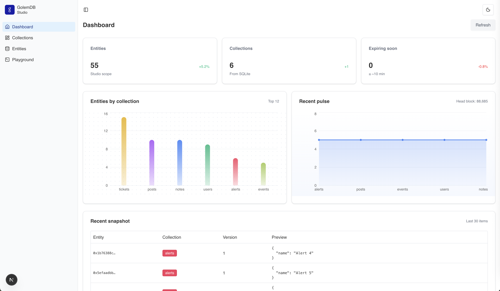

# Golem DB Studio

A modern web interface for exploring and managing [Golem DB](https://golem.network/) entities.  
Built with **Next.js 14**, **shadcn/ui**, and the **Golem Base TypeScript SDK**.



---

## ✨ Features

- **Dashboard Overview**  
  Visual KPIs, animated charts, and collection-based breakdowns.
- **Collections Management**  
  Create and color-code collections for organizing entities.
- **Entity CRUD**  
  Create, read, update, and delete entities with a clean UI.
- **Batch Import**  
  Import multiple entities at once (JSON/JSONL).
- **Query Playground**  
  Write advanced queries with autocomplete and run them live.
- **Expiry Visualization**  
  Progress bars with warning colors for entities expiring soon.

---

## 🚀 Getting Started

### Prerequisites

- Node.js ≥ 18 / Bun ≥ 1.0
- A funded private key on **Kaolin (Golem DB Testnet)**  
  → Get funds via [Kaolin faucet](https://kaolin.holesky.golemdb.io/faucet/).

### Installation

```bash
bun install
```

### Configuration

Create .env.local in the project root:

```ini
GB_CHAIN_ID=60138453025
GB_RPC_URL=https://kaolin.holesky.golemdb.io/rpc
GB_WS_URL=wss://kaolin.holesky.golemdb.io/rpc/ws
GB_PRIVATE_KEY=<your_private_key_hex>
```

### Development

```bash
bun dev
```

### Production

```bash
bun build
bun start
```

## 🧭 Roadmap

- Wallet Connect & SIWE
  - Replace env-based private key with per-user wallet login.
- AI Integration
  - Query entities with natural language.
  - Conversational interface to “talk” with your data.
  - Fine-tune / train entity data for recommendations.
  - Advanced Batch Tools
- CSV import, export, diffing, and merge support.
  - Multi-user Roles
- Admins, developers, and viewers with different permissions.

## 💰 Monetization

- Subscription Tiers
  - Free: limited collections, query playground only.
  - Pro: unlimited entities, batch import/export, AI assistant.
  - Enterprise: multi-user orgs, priority RPC, extended storage.
- Usage-Based Pricing
  - Charge per batch import / per query volume.
  - Pay-as-you-go credits via stablecoins.
- AI Add-Ons
  - Sell credits for AI-powered query translation and data training.

## 🛠️ Tech Stack

- Next.js 15 (App Router)
- shadcn/ui components
- Tailwind CSS
- EvilCharts for analytics
- better-sqlite3 for collections metadata
- golem-base-sdk for Golem DB interactions

## 🤝 Contributing

PRs welcome! Please open an issue for features or bug reports.
